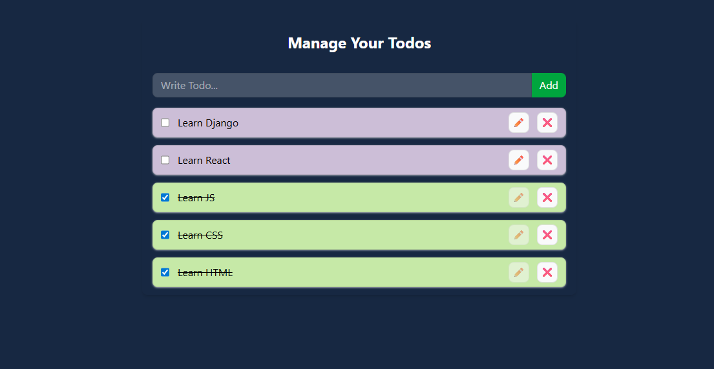

## Project Live url : https://alveetodolist55.netlify.app/
### In this Todo list project we will apply the context API's 2nd way and along with that we will use the local storage

First We create a folder name Contexts under src 
In this folder we will declare all of our contexts here 

Now lets create a context for todo , giving a name "TodoContext.js" 

in "TodoContext.js"  first import basic things to create a context "createContext" , "useContext"
```js
import { useContext,createContext } from "react";
```
##### createContext → Used to create a Context object, which will allow us to share data across components without manually passing props down through each level.


##### useContext → A React hook that lets us consume (access) the values stored in a Context.


##### Create a context : 

```js
export const TodoContext = createContext({})
```

##### Create a provider :

```js
export const Todoprovider = TodoContext.Provider 
```

##### Create a hook: 
 
 ```js
 
export const useTodo = () => {
    return useContext(TodoContext)
}
```

Instead of writing useContext(TodoContext) everywhere in your components, you made a custom hook useTodo().


